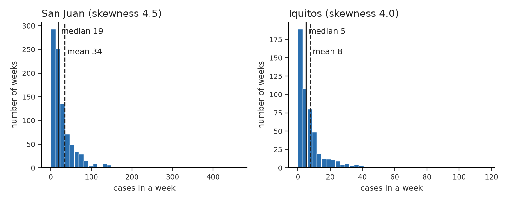
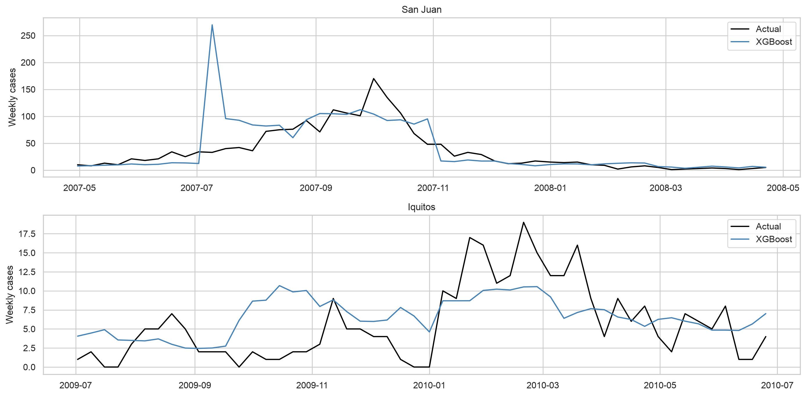
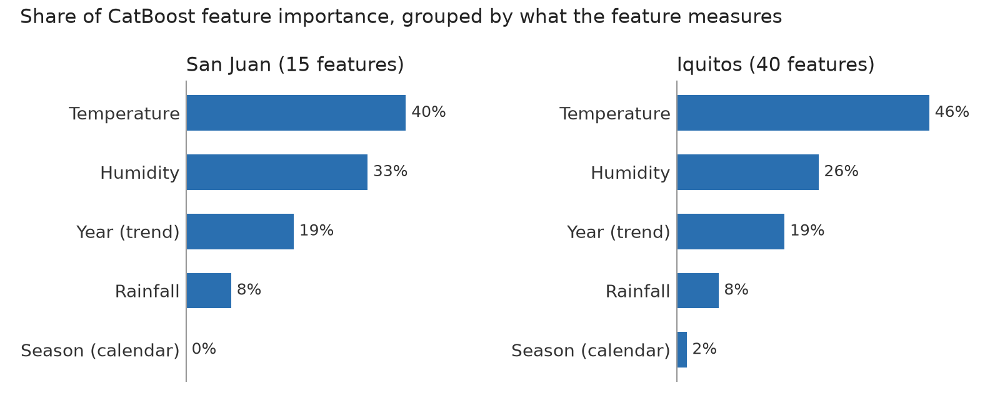

# Metrics

## The competition metric is MAE

$$\text{MAE} = \frac{1}{n}\sum_{i=1}^{n}\bigl|\,\hat{y}_i - y_i\,\bigr|$$

The average number of cases we are off by, per week.

- Reported over all **416 test weeks** (260 San Juan + 156 Iquitos)
- Lower is better; a perfect model scores 0
- Both cities are pooled into one number, so **San Juan dominates** --- it has 63% of the
  test weeks *and* roughly four times the case counts

## Why MAE and not RMSE

The target is extremely skewed:

| | San Juan | Iquitos |
|---|---|---|
| mean cases/week | 34.2 | 7.6 |
| **median** | **19** | **5** |
| max | 461 | 116 |
| **skewness** | **4.48** | **4.00** |

In both cities the **worst 10% of weeks hold 43% of all cases**.

## What "skewed" actually means

## What "skewed" actually means (cont.)

Most weeks have few cases; a handful of outbreak weeks have hundreds. The distribution is
lopsided, with a **long tail to the right**.

- **The mean gets pulled toward the tail.** San Juan's mean is 34 cases, but a typical
  (median) week has 19. About **73% of weeks are below the mean**.
- **Skewness is a number for this lopsidedness.** 0 means symmetric, like a bell curve;
  above 1 already counts as strongly skewed. Ours is **4.5 and 4.0**.
- **Everyday analogy:** income. A few billionaires raise the *average* income, but the
  *median* still describes the typical person.

For us this means that the rare outbreak weeks would dominate any metric that punishes
big errors heavily.

## Why MAE and not RMSE (cont.)

RMSE squares the errors, so a single epidemic week with 461 cases contributes as much as
**~500 ordinary weeks** being off by one.

- Under RMSE the model is dragged into fitting a handful of outbreaks
- MAE weights every week equally
- Statistically: **MAE is minimised by the conditional median, RMSE by the mean** ---
  and for a skewed count distribution the median is the more robust target

This also explains a behaviour we see later: good models here are *conservative*.

# Models

## The pipeline has four branches

Different model families need different preprocessing, so `make_city_pipeline` builds one of
four shapes:

| Branch | Steps | Models |
|---|---|---|
| `tree` | impute → history → cyclical → select → model | CatBoost, RandomForest |
| `dense` | tree steps **+ impute + scale** | Ridge, Lasso |
| `time_series` | impute → history → date + scaled weather | Prophet, SARIMAX |
| `seasonal` | calendar columns only | Seasonal median, Shape×level |

## Why `dense` exists

The `tree` branch leaves **NaNs** in the lag/rolling warm-up --- the first 26 weeks have no
26-week history.

- Tree models (sklearn $\geq$ 1.4) **handle NaN natively**
- `RidgeCV` raises `ValueError: Input X contains NaN`

So linear models get two extra steps: `SimpleImputer(median)` then `StandardScaler`.
Scaling matters for them too, since Ridge and Lasso penalise coefficients and are not
scale-invariant.

## Why `seasonal` exists

The tree branch **drops** `city`, `week_start_date` and `weekofyear` before the model.

But the two calendar baselines need exactly those columns. Rather than weaken the main
branch, they get their own: a `ColumnTransformer` passing through `year` and `weekofyear`,
nothing else.

These models **never see the weather at all** --- which is the point: they are the baseline
any weather-driven model should have to beat.

## The nine models

\scriptsize

| Model | Family | Core assumption |
|----------------|--------------------|------------------------------------|
| CatBoost | gradient boosting | non-linear effects of lagged weather |
| XGBoost | gradient boosting | as CatBoost, on RFE-selected features |
| RandomForest | bagged trees | same, without boosting |
| Ridge | linear + L2 | smooth linear response, all features shrunk |
| Lasso | linear + L1 | linear, but most features are irrelevant |
| Prophet | additive time series | trend + annual seasonality + regressors |
| SARIMAX | ARIMA + exog | autocorrelated errors + Fourier seasonality |
| Seasonal median | calendar only | this week behaves like the same week in past years |
| Shape × level | calendar only | seasonal *shape* × typical annual *total* |

\normalsize

## Results --- holdout MAE

| Model | San Juan | Iquitos |
|---|---|---|
| **CatBoost** | **15.02** | 6.27 |
| RandomForest | 15.16 | 8.39 |
| XGBoost + RFE | 17.21 | 3.54 |
| **Shape × level** | 20.72 | **3.39** |
| Lasso | 21.16 | 4.50 |
| Prophet | 21.78 | 7.16 |
| Seasonal median | 23.49 | 4.41 |
| Ridge | 24.46 | 5.48 |
| SARIMAX | 24.56 | 4.61 |

Different winners per city --- so the final submission uses **CatBoost for San Juan,
SARIMAX for Iquitos**.

## Side experiment --- XGBoost and feature selection

A separate notebook (`experiments/xgboost_feature_selection.ipynb`) asks whether all 127
engineered features help, or whether fewer would do: XGBoost tuned on chronological CV
(3 folds of 52 weeks) with three feature-selection strategies.

| Feature selection | San Juan | Iquitos |
|---|---|---|
| All 127 features | 17.8 | 7.2 |
| XGBoost importance, top 100 | 17.0 | 7.1 |
| **Ridge RFE** | **14.5** (50 features) | **6.7** (10 features) |

CV MAE. Recursive elimination with a *linear* model chose features better than the trees'
own importances did.

## XGBoost on the holdout year

{width=92%}

Holdout MAE **17.21** in San Juan (third; CatBoost 15.02) and **3.54** in Iquitos: the
**best weather-based model** there (SARIMAX 4.61, CatBoost 6.27), with only ten
long-window features. It follows the 2007 outbreak but under-predicts both peaks.

## What drives the CatBoost predictions?

## Feature importance --- what the model is telling us

- **Temperature and humidity carry about 70%** of the importance in both cities.
  Mosquitoes breed and bite more when it is warm and humid.
- **Every top feature is a long average over 8--26 weeks**, not this week's weather. Weather
  acts with a delay: the mosquito population has to build up first.
- **Rainfall matters less than expected** (about 8%). Temperature and humidity already
  capture most of what the rain does.
- **`year` alone takes about 19%.** Case levels drift from year to year for reasons that are
  not weather.

Importance tells us what the model *uses*, not what *causes* dengue.

## Why weather is not the whole story

Feature importance and the results table point the same way. In Iquitos the calendar-only
`Shape × level` model (3.39) beats every weather model:

- Climate reliably predicts **when** cases rise within a year
- It explains very little about **how many**

Epidemic magnitude is driven by which dengue **serotype** is circulating and by population
immunity --- neither is in this dataset.

So a model that predicts the *shape* from the calendar and refuses to guess the *level* from
weather is not naive. It is **honest about what the data supports**.

## Summary

**Metrics** --- MAE, because the target is skewed (skewness 4.5): a few outbreak weeks
would dominate RMSE.

**Models** --- nine models across four pipeline branches, because tree, linear, time-series
and calendar families need different preprocessing. Winners differ by city. A side
experiment with XGBoost confirms that feature selection matters: 50 features beat 127 in
San Juan, and 10 are enough in Iquitos.

**Feature importance** --- CatBoost relies mostly on temperature and humidity averaged over
months. Weather tells us *when* cases rise, not *how many*.
