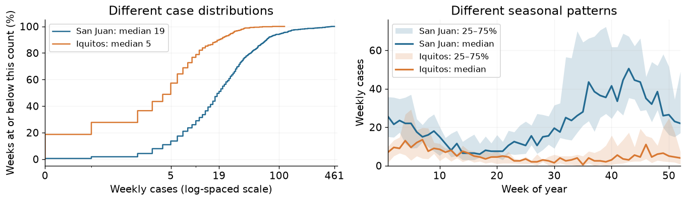
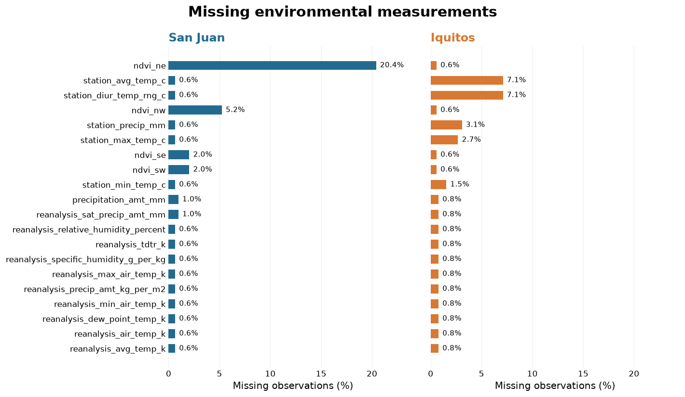
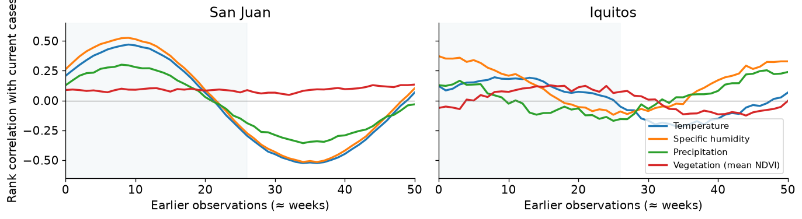
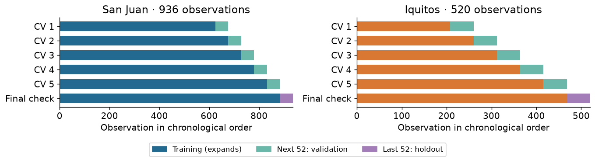
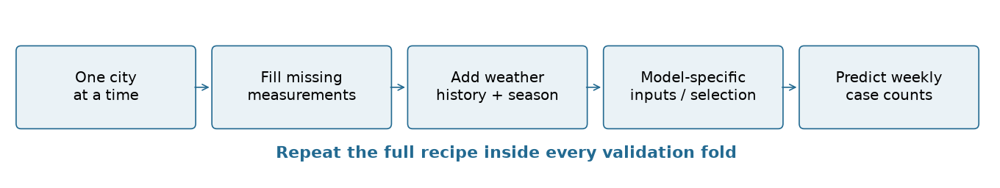
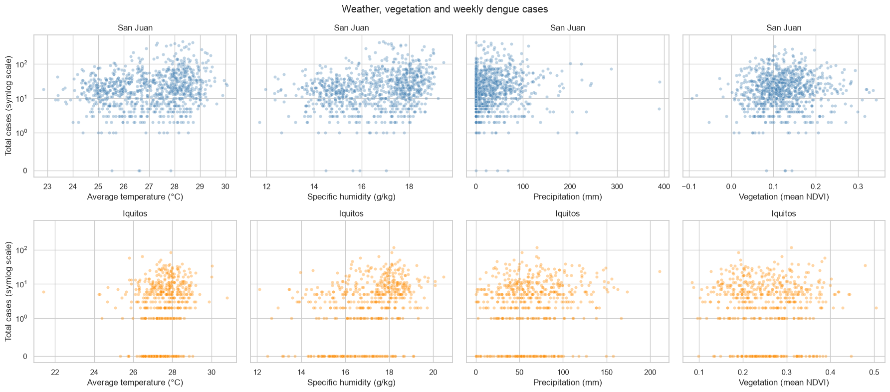

# Part 1 --- The data and the problem

**Goal:** estimate reported dengue cases each week in San Juan, and Iquitos using environmental measurements.

### Load the data and take a first look

    ((1456, 24), (1456, 4), (416, 24))

**1,456 historical weeks**, **416 future weeks**, and **24 input columns**. The labels contain the city-week identifiers and the outcome.

| Column | Row 1 | Row 2 |
|---|---|---|
| city | sj | sj |
| year | 1990 | 1990 |
| weekofyear | 18 | 19 |
| week_start_date | 1990-04-30 | 1990-05-07 |
| ndvi_ne | 0.1226 | 0.1699 |
| ndvi_nw | 0.103725 | 0.142175 |
| ndvi_se | 0.198483 | 0.162357 |
| ndvi_sw | 0.177617 | 0.155486 |
| precipitation_amt_mm | 12.42 | 22.82 |
| reanalysis_air_temp_k | 297.573 | 298.211 |
| reanalysis_avg_temp_k | 297.743 | 298.443 |
| reanalysis_dew_point_temp_k | 292.414 | 293.951 |
| reanalysis_max_air_temp_k | 299.8 | 300.9 |
| reanalysis_min_air_temp_k | 295.9 | 296.4 |
| reanalysis_precip_amt_kg_per_m2 | 32 | 17.94 |
| reanalysis_relative_humidity_percent | 73.3657 | 77.3686 |
| reanalysis_sat_precip_amt_mm | 12.42 | 22.82 |
| reanalysis_specific_humidity_g_per_kg | 14.0129 | 15.3729 |
| reanalysis_tdtr_k | 2.62857 | 2.37143 |
| station_avg_temp_c | 25.4429 | 26.7143 |
| station_diur_temp_rng_c | 6.9 | 6.37143 |
| station_max_temp_c | 29.4 | 31.7 |
| station_min_temp_c | 20 | 22.2 |
| station_precip_mm | 16 | 8.6 |
#### The environmental features come from four sources

**1. Weather stations (5 features)**  
Ground stations measure local average, minimum and maximum temperature, daily temperature range, and rainfall. For example, `station_avg_temp_c` describes average station temperature.

**2. Satellite rainfall (1 feature)**  
`precipitation_amt_mm` measures total rainfall in **mm** over a **0.25° × 0.25° grid cell**. It provides an area-based rainfall measurement alongside the station observations.

**3. Climate reanalysis (10 features)**  
Reanalysis combines observations with a weather model to estimate environmental conditions on a consistent grid. The `reanalysis_` columns describe temperature, dew point, humidity and precipitation at **0.5° × 0.5° resolution**. Temperature levels are in **kelvin**, relative humidity in **%**, and specific humidity in **g/kg**. These describe both heat and moisture conditions.

**4. Satellite vegetation (4 features)**  
The **Normalized Difference Vegetation Index (NDVI)** describes vegetation around each city using **0.5° × 0.5° pixels**. The columns `ndvi_ne`, `ndvi_nw`, `ndvi_se` and `ndvi_sw` refer to pixels north-east, north-west, south-east and south-west of the city centre.

| Group | Column names |
|---|---|
| Location and time | `city`, `year`, `weekofyear`, `week_start_date` |
| Station temperature | `station_avg_temp_c`, `station_min_temp_c`, `station_max_temp_c`, `station_diur_temp_rng_c` |
| Station and satellite rainfall | `station_precip_mm`, `precipitation_amt_mm` |
| Reanalysis temperature | `reanalysis_air_temp_k`, `reanalysis_avg_temp_k`, `reanalysis_min_air_temp_k`, `reanalysis_max_air_temp_k`, `reanalysis_dew_point_temp_k`, `reanalysis_tdtr_k` |
| Reanalysis humidity | `reanalysis_relative_humidity_percent`, `reanalysis_specific_humidity_g_per_kg` |
| Reanalysis precipitation | `reanalysis_precip_amt_kg_per_m2`, `reanalysis_sat_precip_amt_mm` |
| Vegetation | `ndvi_ne`, `ndvi_nw`, `ndvi_se`, `ndvi_sw` |
Source: [DrivenData feature definitions](https://www.drivendata.org/competitions/44/dengai-predicting-disease-spread/page/82/).

|   | city | year | weekofyear | total_cases |
|---|---|---|---|---|
| 0 | sj | 1990 | 18 | 4 |
| 1 | sj | 1990 | 19 | 5 |
| 2 | sj | 1990 | 20 | 4 |
| 3 | sj | 1990 | 21 | 3 |
| 4 | sj | 1990 | 22 | 6 |
**`total_cases` is the value to predict:** a weekly count of reported cases. For example, the first San Juan week has **4 cases**.

### Check the cities and their timelines

**San Juan (`sj`) and Iquitos (`iq`) have different amounts of history.**

| city | count | min | max |
|---|---|---|---|
| iq | 520 | 2000-07-01 | 2010-06-25 |
| sj | 936 | 1990-04-30 | 2008-04-22 |

| city | count | min | max |
|---|---|---|---|
| iq | 156 | 2010-07-02 | 2013-06-25 |
| sj | 260 | 2008-04-29 | 2013-04-23 |
**Each city’s test period follows its training period:** approximately **five years** for San Juan and **three years** for Iquitos. We therefore validate on later weeks.

Next, we examine differences between cities.

### The cities have different case levels and seasons

| city | median | max |
|---|---|---|
| Iquitos | 5 | 116 |
| San Juan | 19 | 461 |


The charts show differences in both the distribution of cases and the time of year when cases are higher. 

**Decision:** perform EDA separately, then prepare and fit a model for each city.

### Missing Data

**Missing measurements across all inputs**:

    ndvi_ne                    194
    ndvi_nw                     52
    station_diur_temp_rng_c     43
    station_avg_temp_c          43
    station_precip_mm           22
    dtype: int64

**Vegetation (NDVI) have the most missing values**



Compare the missing percentage and longest consecutive gap within each city:

| City | Vegetation feature | Missing (%) | Longest gap (observations) |
|---|---|---|---|
| San Juan | ndvi_ne | 20.4 | 15 |
| San Juan | ndvi_nw | 5.2 | 15 |
| San Juan | ndvi_se | 2 | 14 |
| San Juan | ndvi_sw | 2 | 14 |
| Iquitos | ndvi_ne | 0.6 | 1 |
| Iquitos | ndvi_nw | 0.6 | 1 |
| Iquitos | ndvi_se | 0.6 | 1 |
| Iquitos | ndvi_sw | 0.6 | 1 |
**How we fill missing measurements:**

- **San Juan vegetation:** use the typical value (median) for the same week of the year, learned from the training data. If unavailable, use the overall training median for that measurement.
- **Iquitos vegetation:** estimate missing values between the nearest available measurements before and after the gap (linear interpolation).
- **Other weather measurements in both cities:** use the same interpolation approach for gaps between known values.

Why treat San Juan vegetation differently? 
- Its long gaps would otherwise repeat an old value for many weeks if we used forward-fill.

### Weather history

**Why look at earlier weather?**

- **The effect may take time:** weather conditions today may be linked to dengue cases several weeks later. Earlier measurements help the model capture this delay.
- **Good conditions may build up:** our hypothesis is that several weeks of suitable warmth and moisture allow mosquito populations to grow more than one favourable week alone.
- **Duration matters:** rolling averages of temperature and humidity, and rainfall totals, describe whether conditions stayed favourable over several weeks.

**What did we find and use?**

- **In San Juan:** temperature and specific humidity have stronger positive associations with current cases around **8–10 observations earlier** than in the same week. The pattern differs in Iquitos.
- **Weather lags:** include measurements from **1, 2, 4, 8, 10, 20 and 26 observations earlier**.
- **Rolling summaries:** describe weather over the previous **4–26 observations** to capture sustained conditions.
- **Benchmark motivation:** DrivenData also suggests exploring earlier weather to address a mismatch in the timing of predicted cases. [Benchmark discussion](https://drivendata.co/blog/dengue-benchmark/)



### Cross-validation

- **Keep time order:** train on earlier weeks and validate on later weeks.
- **Repeat five times per city:** predict the next **52 observations** (about one year), using more training history each round.
- **Keep a final check:** set aside the last **52 observations** as a separate holdout.
- **Choose settings using CV MAE:** lower average error is better. Then report the holdout error.
- **Why:** a random split would mix earlier and later periods. Chronological CV asks a question closer to the competition task.



### Pipelines

- **One process:** fill gaps, add weather history, prepare inputs and train the model.
- **Avoid data leakage:** learn filling rules, scaling and feature selection from training data only.
- **Fair validation:** keep validation case counts out of training.
- **Consistent predictions:** reuse the same fitted preparation for new data.



# Part 2 --- Metrics, models and preparation

## Metrics

### The competition metric is MAE

$$\text{MAE} = \frac{1}{n}\sum_{i=1}^{n}\bigl|\,\hat{y}_i - y_i\,\bigr|$$

The average number of cases we are off by, per week.

- Reported over all **416 test weeks** (260 San Juan + 156 Iquitos)
- Lower is better; a perfect model scores 0
- Both cities are pooled into one number, so **San Juan dominates** --- it has 63% of the
  test weeks *and* roughly four times the case counts

### Why MAE and not RMSE

The target is extremely skewed:

| | San Juan | Iquitos |
|---|---|---|
| mean cases/week | 34.2 | 7.6 |
| **median** | **19** | **5** |
| max | 461 | 116 |
| **skewness** | **4.48** | **4.00** |

In both cities the **worst 10% of weeks hold 43% of all cases**.

### Why MAE and not RMSE (cont.)

RMSE squares the errors, so a single epidemic week with 461 cases contributes as much as
**~500 ordinary weeks** being off by one.

- Under RMSE the model is dragged into fitting a handful of outbreaks
- MAE weights every week equally
- Statistically: **MAE is minimised by the conditional median, RMSE by the mean** ---
  and for a skewed count distribution the median is the more robust target

This also explains a behaviour we see later: good models here are *conservative*.

### Two different MAEs --- do not confuse them

| | Cross-validation MAE | Holdout MAE |
|---|---|---|
| Computed on | 5 expanding-window folds | one untouched 52-week block |
| Used for | **choosing** hyperparameters | **comparing** final models |
| Seen during tuning? | yes --- the grid optimises it | **no** |

CV MAE is the *tuning signal*. Holdout MAE is the *honest estimate*. They are never equal,
and a large gap between them is itself information: it means the model is overfitting the
folds.

### Why validation must be chronological

Weekly case counts are **autocorrelated at 0.97** from one week to the next.

A random train/test split would therefore put week $t$ in training and week $t+1$ in test ---
the model effectively memorises the answer and the score becomes meaningless.

We use `TimeSeriesSplit(n_splits=5, test_size=52)`: always **train on the past, validate on
the future**.

### The fold structure

| City | Fold | Train ends | Validation |
|---|---|---|---|
| San Juan | 1 | 2002-04-23 | 2002-04-30 → 2003-04-23 |
| San Juan | 3 | 2004-04-22 | 2004-04-29 → 2005-04-23 |
| San Juan | 5 | 2006-04-23 | 2006-04-30 → 2007-04-23 |
| Iquitos | 1 | 2004-06-24 | 2004-07-01 → 2005-06-25 |
| Iquitos | 5 | 2008-06-24 | 2008-07-01 → 2009-06-25 |

Expanding window: each fold trains on everything before it and validates on the next
52 weeks. The final 52 weeks of each city are held back entirely.

### The constraint is enforced, not just intended

`SARIMAXRegressor.predict()` **raises an exception** if asked to predict a block that is not
strictly after its training data:

```python
if pd.to_datetime(X["week_start_date"]).iloc[0] <= self.train_end_:
    raise ValueError("SARIMAX needs a future block "
                     "after its training data.")
```

This makes temporal leakage a crash rather than a silently optimistic score. No shuffling,
no `cross_val_predict`, anywhere in the project.

## Models

### The pipeline has four branches

Different model families need different preprocessing, so `make_city_pipeline` builds one of
four shapes:

| Branch | Steps | Models |
|---|---|---|
| `tree` | impute → history → cyclical → select → model | CatBoost, RandomForest |
| `dense` | tree steps **+ impute + scale** | Ridge, Lasso |
| `time_series` | impute → history → date + scaled weather | Prophet, SARIMAX |
| `seasonal` | calendar columns only | Seasonal median, Shape×level |

### Why `dense` exists

The `tree` branch leaves **NaNs** in the lag/rolling warm-up --- the first 26 weeks have no
26-week history.

- Tree models (sklearn $\geq$ 1.4) **handle NaN natively**
- `RidgeCV` raises `ValueError: Input X contains NaN`

So linear models get two extra steps: `SimpleImputer(median)` then `StandardScaler`.
Scaling matters for them too, since Ridge and Lasso penalise coefficients and are not
scale-invariant.

### Why `seasonal` exists

The tree branch **drops** `city`, `week_start_date` and `weekofyear` before the model.

But the two calendar baselines need exactly those columns. Rather than weaken the main
branch, they get their own: a `ColumnTransformer` passing through `year` and `weekofyear`,
nothing else.

These models **never see the weather at all** --- which is the point: they are the baseline
any weather-driven model should have to beat.

### The eight models

| Model | Family | Core assumption |
|---|---|---|
| CatBoost | gradient boosting | non-linear interactions of lagged weather |
| RandomForest | bagged trees | same, without boosting |
| Ridge | linear + L2 | smooth linear response, all features shrunk |
| Lasso | linear + L1 | linear, but most features are irrelevant |
| Prophet | additive time series | trend + annual seasonality + regressors |
| SARIMAX | ARIMA + exog | autocorrelated errors + Fourier seasonality |
| Seasonal median | calendar only | this week behaves like this week in past years |
| Shape × level | calendar only | seasonal *shape* × typical annual *total* |

### Results --- holdout MAE

| Model | San Juan | Iquitos |
|---|---|---|
| **CatBoost** | **15.02** | 6.27 |
| RandomForest | 15.16 | 8.39 |
| **Shape × level** | 20.72 | **3.39** |
| Lasso | 21.16 | 4.50 |
| Prophet | 21.78 | 7.16 |
| Seasonal median | 23.49 | 4.41 |
| Ridge | 24.46 | 5.48 |
| SARIMAX | 24.56 | 4.61 |

Different winners per city --- so the final submission uses **CatBoost for San Juan,
SARIMAX for Iquitos**.

### The most interesting result

**The best Iquitos model never looks at the weather.**

`Shape × level` scores **3.39**, beating SARIMAX (4.61) and CatBoost (6.27).

It works in two parts:

1. **Shape** --- the seasonal profile, normalised to sum to 1
2. **Level** --- the median annual total of complete training years

$$\hat{y}_{\text{week}} = \text{shape}(\text{week}) \times \text{level}$$

### Why that result makes sense

The decomposition matches what the EDA found:

- Climate reliably predicts **when** cases rise within a year
- It explains very little about **how many**

Epidemic magnitude is driven by which dengue **serotype** is circulating and by population
immunity --- neither is in this dataset.

So a model that predicts the *shape* from the calendar and refuses to guess the *level* from
weather is not naive. It is **honest about what the data supports**.

## Notebook Preparation

### Missing values differ by city

| | San Juan | Iquitos |
|---|---|---|
| `ndvi_ne` missing | **191 / 936 (20.4%)** | 3 / 520 (0.6%) |
| `ndvi_nw` | 49 | 3 |

San Juan is coastal: the north-east NDVI pixel often falls over the **Atlantic**, where the
vegetation index is undefined, and cloud over water blocks the satellite.

One imputation strategy for both cities would be wrong.

### `DengueImputer` --- two strategies

| Columns | Method | Why |
|---|---|---|
| NDVI (San Juan only) | week-of-year training **median**, then overall median | 20% missing in long runs --- interpolation would invent a trend |
| Everything else | linear interpolation, `limit_area="inside"` | weather is smooth in time; a gap is a sensor outage |

`limit_area="inside"` matters: it refuses to extrapolate past the first and last real
observation, so we never fabricate data at the edges.

### Feature engineering --- 20 columns become 124

From **8 weather variables**:

- **Lags** at 1, 2, 4, 8, 10, 20, 26 weeks → `8 × 7 = 56` columns
- **Rolling means** over 4, 8, 10, 12, 16, 26 weeks → `6 × 6 = 36`
- **Rolling sums** (rainfall accumulates, it does not average) → `2 × 6 = 12`

**104 engineered columns** on top of the 20 originals.

Lags matter because the biology is delayed: weather → mosquito breeding → infection →
symptoms → diagnosis takes weeks.

### The leakage trap in rolling features

A rolling mean computed on the **whole dataset** leaks the future into the past.

`WeatherHistoryTransformer` solves this:

```python
def fit(self, X, y=None):
    self.history_ = X.tail(max_history).copy()

def transform(self, X):
    history = self.history_.loc[
        self.history_["week_start_date"] < X["week_start_date"].iloc[0]]
    result = pd.concat([history, X])
    ...
    return result.iloc[-len(X):]
```

### Why that design is right

`fit` memorises only the **tail of the training fold**. `transform` prepends only rows
**strictly earlier** than the incoming block.

So a validation block gets lag features computed from real past data --- not NaN, and not
future data.

Every window is also `.shift(1)` before rolling, so **the current week is never included in
its own average**.

### Why a `Pipeline` and not inline code

Every preprocessing step is **fitted**: medians, scalers, the feature selector, the history
tail.

If preprocessing happens before the split, those statistics are computed on data the model
will later be tested on --- a subtle leak that inflates every score.

Inside a `Pipeline`, `GridSearchCV` refits **the whole chain** on each fold's training part
only. Correctness becomes structural rather than something to remember.

### The refactor --- notebook to package

All machinery moved out of the notebook into an importable package:

```
DengAI/
  transformers.py   DengueImputer, WeatherHistoryTransformer
  selectors.py      CatBoostFeatureSelector
  models/           Prophet, SARIMAX, seasonal baselines
  pipelines.py      make_city_pipeline --- the four branches
  evaluate.py       CV, grid search, holdout, submission
configs/
  features.yaml     columns, lags, windows, imputation
  models.yaml       params, grids, branch per model
```

### Why configuration lives in YAML

One rule keeps it simple:

> Every mapping in the YAML is exactly the `__init__` keyword arguments of the object it
> configures.

```python
WeatherHistoryTransformer(**cfg.features.weather_history)
```

No schema layer, no validation framework. A typo becomes a `TypeError` when the pipeline is
built --- which is the failure you want, loud and immediate.

Changing the lag grid or adding a model is a config edit, not a code change.

### Verification --- we proved the move was safe

Before deleting anything from the notebook, the extracted classes were run **side by side**
with the originals on real data:

```
sj  DengueImputer              IDENTICAL  (936, 24)
sj  WeatherHistoryTransformer  IDENTICAL  (52, 128)
iq  DengueImputer              IDENTICAL  (520, 24)
iq  WeatherHistoryTransformer  IDENTICAL  (52, 128)
```

And the package reproduces the original scores: **SARIMAX San Juan holdout 24.564 vs 24.564
recorded --- exact**, Iquitos CV 6.982 exact, identical fold boundaries.

### Three real bugs found along the way

**1. The notebook could not run in parallel.** CatBoost's `select_features` ignores
`allow_writing_files=False` and does a bare `mkdir("catboost_info")`. With `n_jobs=2`, two
workers race and one dies with `FileExistsError`. Fixed with a per-fit `train_dir`.

**2. `KeyError: 'catboost'`** in the holdout cells --- they refit from a dict only populated
for models loaded from disk. They now read predictions already computed.

**3. The submission model choice was declared twice, inconsistently.** Now stated once,
in `models.yaml`.

### Summary of part 2

**Metrics** --- MAE because the target is skewed (skewness 4.5); CV MAE tunes, holdout MAE
judges; validation is chronological because adjacent weeks correlate at 0.97.

**Models** --- eight models across four pipeline branches, because tree, linear, time-series
and calendar families need different preprocessing. Winners differ by city.

**Preparation** --- city-specific imputation, 104 leakage-safe engineered features, and a
`Pipeline` so that correctness is structural. All of it extracted into a package with YAML
configuration, verified byte-identical before the originals were removed.

# Part 3 --- Additional EDA

### Setup

Weekly case counts per city:

| City | count | mean | std | min | 25% | 50% | 75% | max |
|---|---|---|---|---|---|---|---|---|
| Iquitos | 520 | 7.57 | 10.77 | 0 | 1 | 5 | 9 | 116 |
| San Juan | 936 | 34.18 | 51.38 | 0 | 9 | 19 | 37 | 461 |

### Weekly cases


### Seasonality


San Juan tends to have higher counts later in the year, while Iquitos has higher medians near the beginning. This supports exploring seasonal features separately for the cities.

### Weather and cases



### Missing values


### Weather lags

Compare earlier weather and vegetation with current cases using Spearman correlation. A lag of 4 means four rows earlier, approximately four weeks.


