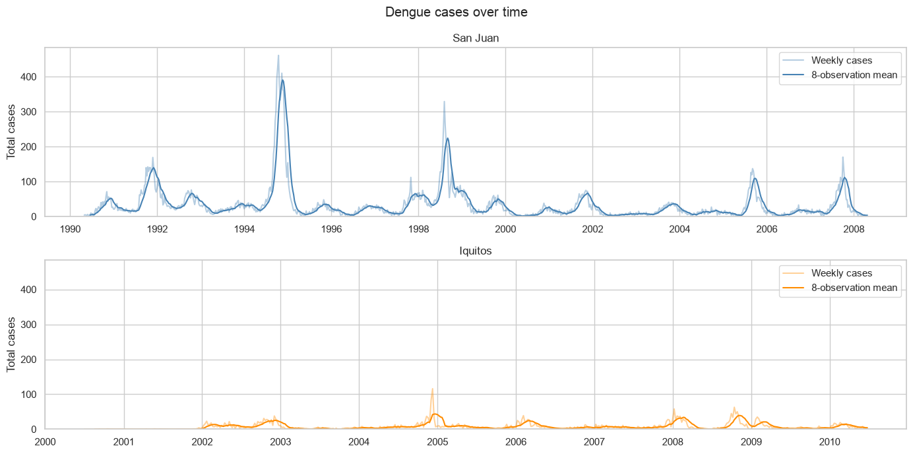
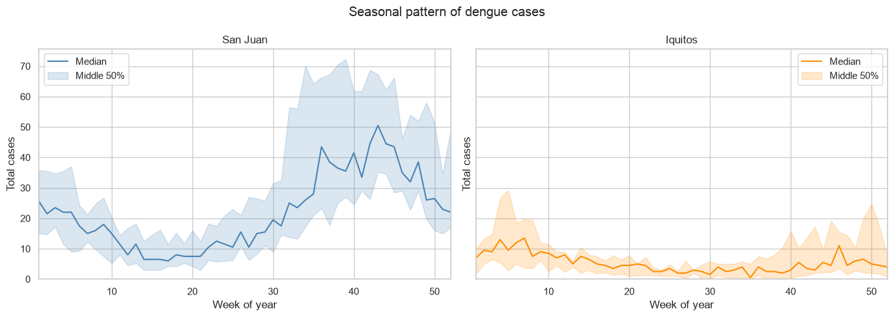
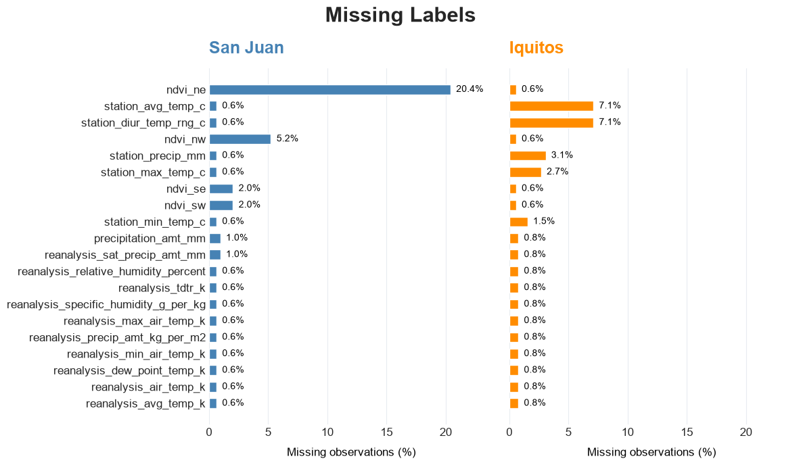
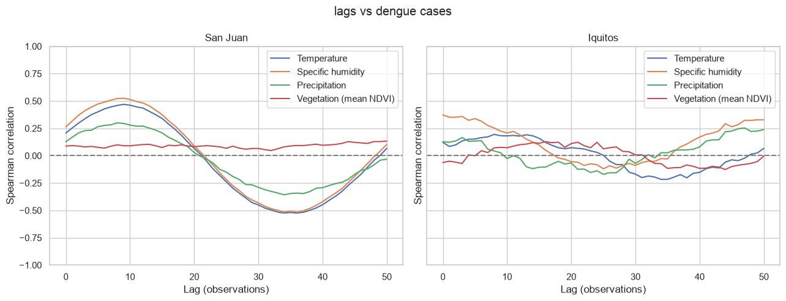

# Additional EDA

# EDA setup

Weekly case counts per city:

| City | count | mean | std | min | 25% | 50% | 75% | max |
|---|---|---|---|---|---|---|---|---|
| Iquitos | 520 | 7.57 | 10.77 | 0 | 1 | 5 | 9 | 116 |
| San Juan | 936 | 34.18 | 51.38 | 0 | 9 | 19 | 37 | 461 |

## Weekly cases

## Seasonality

San Juan tends to have higher counts later in the year, while Iquitos has higher medians near the beginning. This supports exploring seasonal features separately for the cities.

## Weather and cases

## Missing values

## Weather lags

Compare earlier weather and vegetation with current cases using Spearman correlation. A lag of 4 means four rows earlier, approximately four weeks.

